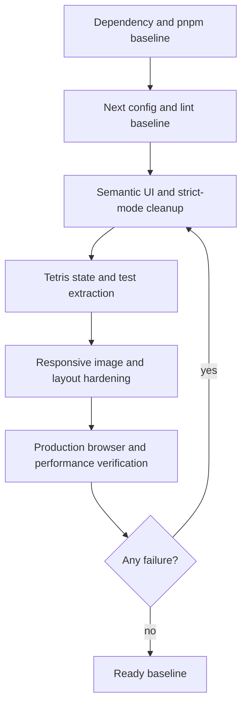
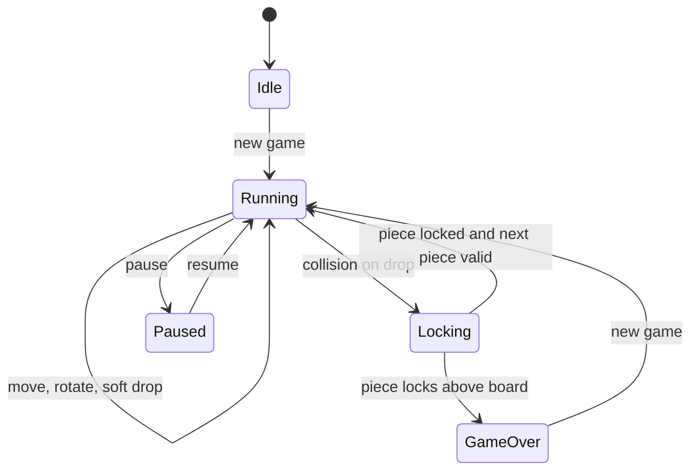

# chore: Modernize Next baseline

## Summary

Modernize the Dinner with Friends desktop playground onto the current Next.js and React baseline, remove obvious bugs and accessibility gaps, and add a repeatable verification loop for lint, build, browser behavior, and performance.

---

## Problem Frame

The project is a compact Next.js Pages Router app with an interactive desktop surface, draggable windows, optimized local imagery, and a custom Tetris widget. It is already on React 19 and Next 15, but its package manager declaration, framework packages, lint setup, strict-mode posture, and interactive semantics lag current 2026 guidance. The user asked for the repo to be set up, dependencies updated, bugs found, and performance confirmed before using it as a base for future improvements.

---

## Requirements

### Dependency and Tooling Baseline

- R1. The app installs from a clean checkout with the declared package manager and an updated lockfile.
- R2. Runtime dependencies and dev dependencies are upgraded to current stable releases that are compatible with the app's Pages Router architecture.
- R3. Framework configuration follows current Next.js guidance for linting and React strict-mode checks.

### Application Quality

- R4. Interactive controls use semantic, keyboard-reachable elements with visible focus states.
- R5. Existing desktop, theme, draggable-window, image, email, and Tetris behaviors remain available after the upgrade.
- R6. Dead or invalid styling is removed without changing the intended visual language.
- R7. Tetris state transitions avoid stale closures and strict-mode-sensitive side effects.

### Verification and Performance

- R8. The project has repeatable scripts for linting, building, and automated behavior checks.
- R9. Browser verification covers the first viewport, theme switching, window minimize/restore, image rendering, and Tetris startup.
- R10. Production performance is measured with explicit pass/fail targets: no failed build-time performance warnings, no missing critical assets, no layout overlap in first-viewport screenshots, and a browser performance score of at least 90 when Lighthouse-style scoring is available.

---

## Assumptions

- A1. Keep the app on the Pages Router for this baseline pass; a Pages-to-App Router migration is larger than the requested setup and would change the project shape.
- A2. Preserve the existing desktop/art-direction language rather than redesigning the product.
- A3. Prefer focused automated coverage around the existing behavior over broad snapshot tests.
- A4. Use latest stable package versions from the npm registry as of 2026-06-20: Next `16.2.9`, React `19.2.7`, React DOM `19.2.7`, framer-motion `12.40.0`, react-draggable `4.7.0`, ESLint `10.5.0`, eslint-config-next `16.2.9`, `@eslint/eslintrc` `3.3.5`, and pnpm `11.8.0`.

---

## Key Technical Decisions

- KTD1. **Upgrade in place, then fix compatibility fallout:** Start with the dependency and package-manager baseline so lint, build, and runtime failures reflect the target stack rather than the old one.
- KTD2. **Use official Next lint CLI flow:** Next 16 no longer relies on `next build` to run linting, so `pnpm lint` remains an explicit gate and the flat config should use the current `eslint-config-next/core-web-vitals` shape.
- KTD3. **Enable React strict mode after effect cleanup:** Next and React recommend strict-mode checks for catching impure rendering and missing cleanup; this app has timers, body mutation, global keyboard listeners, and draggable refs that need to tolerate development double checks.
- KTD4. **Keep browser-only boundaries narrow:** `AnimatedWindow` and Tetris can remain dynamic imports because they depend on browser interactions; other static desktop structure should stay in the page bundle only when it is needed for first render.
- KTD5. **Separate pure game logic where it reduces risk:** Tetris carries the most stateful logic in the app, so extracting testable pure helpers is justified if the upgrade exposes stale state or strict-mode issues.
- KTD6. **Verify performance against production output:** Development-server impressions are not enough; performance should be checked from a production build with browser automation or Lighthouse-style metrics.

---

## High-Level Technical Design

The work proceeds as a compatibility-and-quality loop: update the shared runtime contract first, fix strict-mode and lint fallout in the UI, add focused tests for the highest-risk stateful logic, then verify the production build visually and with performance measurements.

The stateful Tetris loop should stay idempotent under strict mode: effects install one timer/listener, cleanup removes it, and game transitions advance through functional state updates or pure helpers.

---

## Implementation Units

### U1. Dependency And Package-Manager Modernization

- **Goal:** Update package metadata and lockfile to the current stable dependency baseline.
- **Requirements:** R1, R2
- **Dependencies:** None
- **Files:** `package.json`, `pnpm-lock.yaml`, `README.md`
- **Approach:** Use pnpm to update all declared dependencies to current stable versions, pin the project package manager to pnpm 11, and keep README setup instructions consistent with the new declaration. Do not introduce a framework migration or unrelated dependency family unless a compatibility issue requires it.
- **Patterns to follow:** Existing `package.json` script shape and README verification section.
- **Test scenarios:** Confirm a clean `pnpm install` completes and leaves the lockfile consistent with `package.json`.
- **Verification:** Dependency install succeeds, `pnpm-lock.yaml` changes are explainable, and README no longer instructs contributors to use pnpm 8.

### U2. Next Configuration And Lint Baseline

- **Goal:** Bring Next.js configuration, strict mode, and lint setup in line with current guidance.
- **Requirements:** R3, R8
- **Dependencies:** U1
- **Files:** `next.config.js`, `eslint.config.mjs`, `package.json`
- **Approach:** Enable `reactStrictMode`, move the lint config toward the current `eslint-config-next/core-web-vitals` flat-config pattern, and add missing explicit scripts only when they are part of the repeatable verification workflow.
- **Patterns to follow:** Current flat config file, official Next ESLint guidance, repository rule that lint warnings are blockers.
- **Test scenarios:** Run lint with the updated config and confirm framework/Core Web Vitals violations are surfaced as errors.
- **Verification:** `pnpm lint` passes after implementation fixes, and `pnpm build` no longer masks lint failures because lint is an explicit script-level gate.

### U3. Semantic Interaction And Accessibility Cleanup

- **Goal:** Fix interactive markup and focus behavior without changing the desktop visual language.
- **Requirements:** R4, R5, R6
- **Dependencies:** U1, U2
- **Files:** `pages/index.js`, `components/DesktopIcon.jsx`, `components/Window.jsx`, `styles/Home.module.css`, `styles/DesktopIcon.module.css`, `styles/Window.module.css`, `styles/WindowContent.module.css`, `styles/globals.css`
- **Approach:** Replace clickable non-controls with buttons where they trigger actions, add accessible labels for icon-like controls, preserve the existing retro desktop styling through CSS resets, and remove dead global Tetris CSS that references undefined tokens.
- **Patterns to follow:** Existing CSS module token usage, existing window title-bar/desktop-icon visual structure, Next Image usage for local portraits.
- **Test scenarios:** Press Tab through the first viewport and confirm theme controls, desktop icons, and actionable buttons receive visible focus. Activate desktop icons with keyboard and pointer and confirm windows minimize or restore. Submit controls remain non-breaking even if the email form is still a visual stub.
- **Verification:** Lint passes without accessibility warnings, keyboard interaction matches pointer interaction, and the visual desktop composition remains recognizable.

### U4. Strict-Mode-Safe State And Tetris Logic

- **Goal:** Make the stateful game loop safe under React strict mode and easier to verify.
- **Requirements:** R5, R7, R8
- **Dependencies:** U2
- **Files:** `components/tetris.jsx`, `components/__tests__/tetris.test.jsx`, optionally `components/tetrisLogic.js`, `package.json`
- **Approach:** Audit game callbacks for stale board, active-piece, line, and level closures; use functional state updates where the next value depends on the previous value; extract pure board/piece helpers if needed for focused tests; keep the global keydown listener cleaned up through effect teardown.
- **Patterns to follow:** Existing pure helper style in `components/tetris.jsx`, Vercel React guidance for functional `setState`, narrow effect dependencies, and deduplicated global listeners.
- **Test scenarios:** Start a new game with an empty board and verify an active piece and next piece are produced. Move and rotate a piece at board edges and verify invalid placements are rejected. Clear one, two, three, and four lines and verify score/line/level outcomes. Locking above the visible board ends the game. Keyboard listener cleanup prevents duplicate movement after remount.
- **Verification:** Component or helper tests pass, Tetris starts in the browser, and strict mode does not create duplicate timers or duplicate keyboard handlers.

### U5. Responsive Layout And Image Performance Hardening

- **Goal:** Preserve the desktop aesthetic while preventing first-viewport overflow, hidden controls, and avoidable image costs.
- **Requirements:** R5, R6, R9, R10
- **Dependencies:** U3
- **Files:** `pages/index.js`, `styles/Home.module.css`, `styles/WindowContent.module.css`, `public/images/alex.jpg`, `public/images/justin.jpg`, `public/images/dwf-logo.svg`
- **Approach:** Add responsive constraints for hero text, footer copy, icon stack, and initial window positions so the app is usable on common desktop and mobile widths. Revisit `next/image` props so local portraits retain explicit sizing, stable layout, and appropriate loading priority.
- **Patterns to follow:** Existing CSS variables and `next/image` usage; frontend design guidance for preserving the current design system and verifying visually.
- **Test scenarios:** Load the page at desktop and mobile widths and confirm no important text or controls overlap. Toggle light/dark themes and confirm contrast remains acceptable. Verify the portrait image renders without layout shift or missing alt text.
- **Verification:** Browser screenshots show a non-broken first viewport at representative desktop and mobile sizes, and production performance checks do not flag avoidable image/layout issues.

### U6. Browser And Performance Verification Harness

- **Goal:** Add enough automated browser coverage and measurement to prove the baseline is healthy.
- **Requirements:** R8, R9, R10
- **Dependencies:** U1, U3, U4, U5
- **Files:** `package.json`, `README.md`, optionally `playwright.config.js`, `tests/desktop.spec.js`
- **Approach:** Add a lightweight browser test harness only if the repo lacks equivalent tooling, target the critical interactive flows, and record performance evidence from the production build. Use browser automation for functional smoke checks and a Lighthouse-style or browser timing check for performance.
- **Patterns to follow:** Existing README verification workflow and frontend design visual verification requirement.
- **Test scenarios:** Production page loads successfully. Theme toggle changes the active theme. Each desktop icon can minimize and restore its matching window. Tetris renders a populated board and the new-game control works. The portrait image completes loading. Performance metrics are captured from the production build.
- **Verification:** `pnpm lint`, automated tests, `pnpm build`, production smoke checks, and performance measurement all pass. The performance gate records the measured score or timing evidence and treats scores below 90, missing critical assets, first-viewport layout overlap, or failed production navigation as blockers to fix before PR creation.

---

## Scope Boundaries

### In Scope

- Updating all declared dependencies to current stable compatible releases.
- Fixing bugs, lint issues, accessibility problems, strict-mode fallout, and performance issues discovered during verification.
- Adding focused automated coverage and browser/performance verification suitable for this repo size.

### Deferred to Follow-Up Work

- Migrating from the Pages Router to the App Router.
- Replacing the email visual stub with a real backend or third-party form provider.
- Redesigning the Dinner with Friends brand direction, copy strategy, or content architecture.
- Adding analytics, monitoring, or deployment-specific CI beyond what is needed to prove this baseline.

---

## System-Wide Impact

The upgrade affects all runtime surfaces because Next, React, eslint-config-next, and pnpm are shared project contracts. Strict mode can expose bugs in effects and refs during development, but production behavior should remain unchanged after cleanup. Browser tests and performance checks become part of the project baseline and should be maintained with future UI work.

---

## Risks And Mitigations

- **Risk:** Next 16 or ESLint 10 exposes breaking changes that are not obvious from static inspection. **Mitigation:** Upgrade first, then use lint/build/test output to drive compatibility fixes instead of guessing.
- **Risk:** React strict mode reveals duplicated timers or event listeners in Tetris. **Mitigation:** Make effects idempotent, clean up listeners, and add tests around remount behavior.
- **Risk:** Adding browser testing increases setup cost for a small app. **Mitigation:** Keep the harness focused on smoke and performance-critical flows rather than broad visual snapshot coverage.
- **Risk:** Responsive fixes could dilute the intentional desktop-art-board feel. **Mitigation:** Preserve existing tokens, typography choices, and window styling while adding constraints that prevent broken layouts.

---

## Sources And Research

- `package.json` currently declares Next `15.5.6`, React `19.2.0`, pnpm `8.15.5`, and minimal lint/build scripts.
- `next.config.js` currently disables `reactStrictMode`.
- `pages/index.js` owns the desktop state, theme mutation, dynamic browser-only windows, and local portrait image.
- `components/tetris.jsx` owns the custom game loop, global keyboard listener, scoring, line clearing, and board rendering.
- `styles/globals.css` contains dead legacy Tetris CSS and an undefined `--brand-primary` reference.
- Next.js Version 16 upgrade guide: https://nextjs.org/docs/app/guides/upgrading/version-16
- Next.js installation and linting guidance: https://nextjs.org/docs/app/getting-started/installation
- Next.js ESLint configuration guidance: https://nextjs.org/docs/app/api-reference/config/eslint
- Next.js `reactStrictMode` configuration: https://nextjs.org/docs/pages/api-reference/config/next-config-js/reactStrictMode
- React StrictMode reference: https://react.dev/reference/react/StrictMode
- Next Image component reference: https://nextjs.org/docs/app/api-reference/components/image
- pnpm Corepack installation guidance: https://pnpm.io/installation
